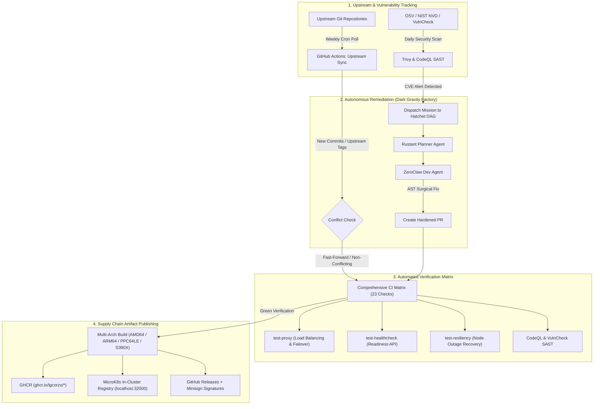

<picture>
  <source media="(prefers-color-scheme: dark)" srcset="https://raw.githubusercontent.com/lgcorzo/sidekick/master/sidekick_logo_dark.png">
  
</picture>

 

> [!NOTE]
> **UPSTREAM STATUS & FORK PURPOSE**: While upstream MinIO has archived or restricted legacy repositories in favor of proprietary distributions, this repository is actively maintained and hardened under `@lgcorzo` as a critical high-performance sidecar proxy for the [Dark Gravity Autonomous CA/CD Factory](https://github.com/lgcorzo/rust_CACD_autonomous_factory).

---

## 🛡️ Dark Gravity Factory: Security Maintenance & Sovereign Rationale

### 1. Why Sovereign Maintenance Continues on this Repository

In the **Dark Gravity Autonomous CA/CD Software Factory**, *sidekick* serves as an essential client-side proxy providing high-performance, low-latency S3 load balancing, automatic failover, and request-level health verification across distributed MinIO storage nodes.

Upstream MinIO's shift toward proprietary AIStor and unannounced deprecations of community utilities creates supply-chain risks. In a zero-trust, autonomous multi-agent engineering factory:
- **Full Supply-Chain Autonomy:** Zero reliance on upstream breaking license changes or unannounced deprecations.
- **Dark Gravity Factory Core Integration:** Essential sidecar proxy powering autonomous AI agent pipelines, high-throughput storage routing, zero-downtime failover, and gVisor worker isolation.
- **Compliance & Security:** Active sovereign maintenance ensuring compliance with EU AI Act (Art. 12 & 14), SOC 2 Type II, ISO/IEC 25059, and strict zero-CVE SLAs.
- **Ecosystem Interoperability:** Direct integration with all 38 repositories in `@lgcorzo` (MinIO Server, MC, KES, Operator, DirectPV, Console, SIMD libraries, etc.).

---

### 2. Sovereign MinIO Ecosystem: Maintained Repositories in @lgcorzo

To guarantee long-term sovereign support, full supply-chain independence, and continuous security patching, the complete MinIO ecosystem of 38 repositories is actively maintained under `@lgcorzo`:

| Category | Repository | Description | Key Capabilities |
| :--- | :--- | :--- | :--- |
| **Core Storage & Server** | [lgcorzo/minio](https://github.com/lgcorzo/minio) | High-performance Object Storage Server | Multi-tenant S3-compatible engine, Erasure Coding, Tiering |
| | [lgcorzo/mc](https://github.com/lgcorzo/mc) | MinIO Client CLI Tool | High-speed mirror, diff, administration, encryption management |
| | [lgcorzo/kes](https://github.com/lgcorzo/kes) | Key Encryption Server (KES) | High-performance KMS proxy (Vault, AWS-KMS, GCP-KMS, Azure Key Vault) |
| | [lgcorzo/console](https://github.com/lgcorzo/console) | Graphical Web Administration Interface | Visual bucket policy management, IAM administration, observability |
| | [lgcorzo/operator](https://github.com/lgcorzo/operator) | Kubernetes Operator | Declarative MinIO Tenant orchestration, CRD management |
| | [lgcorzo/directpv](https://github.com/lgcorzo/directpv) | Kubernetes CSI Direct Storage Driver | High-throughput direct-attached NVMe/SSD volume provisioner |
| | [lgcorzo/sidekick](https://github.com/lgcorzo/sidekick) | High-Performance S3 Proxy | Low-latency client-side load balancing and failover sidecar proxy |
| | [lgcorzo/docs](https://github.com/lgcorzo/docs) | Documentation Source & Engine | Sphinx-based documentation build system and architecture references |
| **SDKs & APIs** | [lgcorzo/minio-go](https://github.com/lgcorzo/minio-go) | Official Go Client SDK | Idiomatic Go SDK for object storage operations, multipart uploads, STS |
| | [lgcorzo/madmin-go](https://github.com/lgcorzo/madmin-go) | MinIO Admin Go Library | Administrative APIs for server configuration, user management, healing |
| | [lgcorzo/kms-go](https://github.com/lgcorzo/kms-go) | Cryptographic KMS Client Library | Go client primitives for key creation, DEK derivation, envelope encryption |
| | [lgcorzo/pkg](https://github.com/lgcorzo/pkg) | Common Go Utility Packages | Cryptographic certificates, hashing routines, and shared helper primitives |
| | [lgcorzo/mtls](https://github.com/lgcorzo/mtls) | Mutual TLS Utilities | Zero-trust inter-node cryptographic identity verification |
| **Hardware & SIMD** | [lgcorzo/sha256-simd](https://github.com/lgcorzo/sha256-simd) | SIMD-Accelerated SHA256 | AVX-512 and ARMv8 Crypto Extensions SHA256 acceleration |
| | [lgcorzo/md5-simd](https://github.com/lgcorzo/md5-simd) | SIMD-Accelerated MD5 | Parallel AVX-512 and AVX2 MD5 calculation |
| | [lgcorzo/blake2b-simd](https://github.com/lgcorzo/blake2b-simd) | SIMD-Accelerated BLAKE2b | Pure Go cryptographic hashing leveraging AVX2/AVX512/SSSE3 |
| | [lgcorzo/highwayhash](https://github.com/lgcorzo/highwayhash) | SIMD HighwayHash | High-speed native hashing (>10 GB/s per core) |
| | [lgcorzo/crc64nvme](https://github.com/lgcorzo/crc64nvme) | NVMe CRC64 SIMD Acceleration | Fast carryless-multiplication CRC64 checksums |
| | [lgcorzo/simdjson-go](https://github.com/lgcorzo/simdjson-go) | High-Throughput SIMD JSON Parser | Gigabytes/sec JSON parsing leveraging vector instructions |
| | [lgcorzo/sio](https://github.com/lgcorzo/sio) | Data At Rest Encryption (DARE) | Streaming authenticated encryption format |
| | [lgcorzo/asm2plan9s](https://github.com/lgcorzo/asm2plan9s) | Assembly Bytecode Converter | Converts AVX512/AVX2/ARM assembly instructions into Go Plan9 bytecode |
| **Networking & Routing** | [lgcorzo/mux](https://github.com/lgcorzo/mux) | High-Performance Request Router | Matcher and multiplexer for incoming S3 REST and STS API routes |
| | [lgcorzo/websocket](https://github.com/lgcorzo/websocket) | Low-Latency WebSocket Engine | High-throughput duplex communication for real-time console |
| | [lgcorzo/dnscache](https://github.com/lgcorzo/dnscache) | DNS Lookup Caching | In-memory DNS cache minimizing latency on distributed lookups |
| **Data Formats & Helpers** | [lgcorzo/zipindex](https://github.com/lgcorzo/zipindex) | Fast ZIP Archive Indexer | Compressed index lookup enabling direct random reads of ZIP archives |
| | [lgcorzo/xxml](https://github.com/lgcorzo/xxml) | Extended XML 1.0 Parser | Robust XML namespace support for strict S3 API compliance |
| | [lgcorzo/colorjson](https://github.com/lgcorzo/colorjson) | Colorized JSON Encoder | Human-readable terminal logging and JSON inspection |
| | [lgcorzo/csvparser](https://github.com/lgcorzo/csvparser) | High-Performance CSV Parser | Streaming CSV parsing engine for S3 Select query execution |
| | [lgcorzo/filepath](https://github.com/lgcorzo/filepath) | Lexically Sorted Flat Path Walker | High-efficiency directory walking and flat object key enumeration |
| | [lgcorzo/selfupdate](https://github.com/lgcorzo/selfupdate) | Binary Self-Updating Library | Secure signature-verified self-upgrades for CLI binaries |
| | [lgcorzo/cli](https://github.com/lgcorzo/cli) | Minimalist CLI Framework | Lightweight command-line argument parser for distributed utilities |
| **Testing & Tooling** | [lgcorzo/mint](https://github.com/lgcorzo/mint) | Integration Test Suite | End-to-end multi-language test suite certifying S3 compliance |
| | [lgcorzo/warp](https://github.com/lgcorzo/warp) | S3 Benchmarking Tool | High-throughput synthetic benchmark suite measuring IOPS and latency |
| | [lgcorzo/dperf](https://github.com/lgcorzo/dperf) | Distributed Performance Benchmark | Stress-testing network bandwidth, disk I/O, and CPU throughput |
| | [lgcorzo/certgen](https://github.com/lgcorzo/certgen) | TLS Certificate Generator | Standalone zero-dependency x.509 TLS certificate generation utility |
| | [lgcorzo/pkger](https://github.com/lgcorzo/pkger) | Binary Packaging Utility | Multi-architecture DEB, RPM, and APK packaging automation tool |
| | [lgcorzo/multipart-debug](https://github.com/lgcorzo/multipart-debug) | S3 Diagnostic Tool | Low-level multipart upload debugging and encryption validation |
| | [lgcorzo/minio-cf](https://github.com/lgcorzo/minio-cf) | Cloud Foundry Integration | Support for deploying MinIO within Cloud Foundry estates |

---

### 3. Sovereign Maintenance Protocol & CI/CD Lifecycle



---

# About sidekick

*sidekick* is a high-performance sidecar load balancer. By attaching a tiny load balancer to each client application process, you can eliminate the need for a centralized load balancer and DNS failover management. *sidekick* automatically avoids sending traffic to failed servers by checking their health via readiness APIs and HTTP error returns.

# Architecture


# Install

## Binary Releases

| OS      | ARCH    | Binary                                                                                                 |
|:-------:|:-------:|:------------------------------------------------------------------------------------------------------:|
| Linux   | amd64   | [linux-amd64](https://github.com/lgcorzo/sidekick/releases/latest/download/sidekick-linux-amd64)         |
| Linux   | arm64   | [linux-arm64](https://github.com/lgcorzo/sidekick/releases/latest/download/sidekick-linux-arm64)         |
| Linux   | ppc64le | [linux-ppc64le](https://github.com/lgcorzo/sidekick/releases/latest/download/sidekick-linux-ppc64le)     |
| Linux   | s390x   | [linux-s390x](https://github.com/lgcorzo/sidekick/releases/latest/download/sidekick-linux-s390x)         |
| Apple   | amd64   | [darwin-amd64](https://github.com/lgcorzo/sidekick/releases/latest/download/sidekick-darwin-amd64)       |
| Windows | amd64   | [windows-amd64](https://github.com/lgcorzo/sidekick/releases/latest/download/sidekick-windows-amd64.exe) |

Verify binary integrity with [minisign](https://jedisct1.github.io/minisign/):
```bash
minisign -Vm sidekick-<OS>-<ARCH> -P RWTx5Zr1tiHQLwG9keckT0c45M3AGeHD6IvimQHpyRywVWGbP1aVSGav
```

## Docker

Pull container image:
```bash
docker pull ghcr.io/lgcorzo/sidekick:latest
```

## Build from Source

```bash
go install -v github.com/lgcorzo/sidekick@latest
```

> [!IMPORTANT]
> Requires Go 1.24 or higher.

# Usage

```
NAME:
  sidekick - High-Performance sidecar load-balancer

USAGE:
  sidekick - [FLAGS] SITE1 [SITE2..]

FLAGS:
  --address value, -a value           listening address for sidekick (default: ":8080")
  --health-path value, -p value       health check path
  --read-health-path value, -r value  health check path for read access - valid only for failover site
  --health-port value                 health check port (default: 0)
  --health-duration value, -d value   health check duration in seconds (default: 5s)
  --health-timeout value              health check timeout in seconds (default: 10s)
  --insecure, -i                      disable TLS certificate verification
  --rr-dns-mode                       enable round-robin DNS mode
  --log, -l                           enable logging
  --trace value, -t value             enable request tracing - valid values are [all,application,minio] (default: "all")
  --quiet, -q                         disable console messages
  --json                              output sidekick logs and trace in json format
  --debug                             output verbose trace
  --cacert value                      CA certificate to verify peer against
  --client-cert value                 client certificate file
  --client-key value                  client private key file
  --cert value                        server certificate file
  --key value                         server private key file
  --pprof :1337                       start and listen for profiling on the specified address (e.g. :1337)
  --dns-ttl value                     choose custom DNS TTL value for DNS refreshes for load balanced endpoints (default: 10m0s)
  --errors, -e                        filter out any non-error responses
  --status-code value                 filter by given status code
  --host-balance value                specify the algorithm to select backend host when load balancing, supported values are 'least', 'random' (default: "least")
  --help, -h                          show help
  --version, -v                       print the version
```

## Examples

### Load balance across a web service using DNS provided IPs.
```bash
$ sidekick --health-path=/ready http://myapp.myorg.dom
```

### Load balance across 4 MinIO Servers.
```bash
$ sidekick --health-path=/minio/health/ready --address :8000 http://minio{1...4}:9000
```

### Load balance across two sites with four servers each
```bash
$ sidekick --health-path=/minio/health/ready http://site1-minio{1...4}:9000 http://site2-minio{1...4}:9000
```

## Realworld Example with spark-operator

With spark as *driver* and sidecars as *executor*, first install spark-operator and MinIO on your Kubernetes cluster.

### Configure *spark-operator*

```bash
helm repo add spark-operator https://googlecloudplatform.github.io/spark-on-k8s-operator
helm --namespace spark-operator install spark-operator spark-operator/spark-operator --create-namespace --set sparkJobNamespace=spark-operator --set enableWebhook=true
```

### Install *MinIO*. 

```bash
helm repo add minio-operator https://operator.min.io/
helm install operator minio-operator/operator --namespace minio-operator --create-namespace
  
helm install myminio minio-operator/tenant --namespace tenant-sidekick --create-namespace && \
kubectl --namespace tenant-sidekick patch tenant myminio --type='merge' -p '{"spec":{"requestAutoCert":false}}'
```

Once the tenant pods are running, port-forward the minio headless service to access it locally:
```bash
kubectl --namespace tenant-sidekick port-forward svc/myminio-hl 9000 &
```

Configure [`mc`](https://github.com/lgcorzo/mc) and upload test data:
```bash
mc alias set myminio http://localhost:9000 minio minio123
mc mb myminio/mybucket
mc cp /etc/hosts myminio/mybucket/mydata.txt
```

### Run Spark Job with Sidekick

```yaml
cat << EOF > spark-job.yaml
apiVersion: "sparkoperator.k8s.io/v1beta2"
kind: SparkApplication
metadata:
  name: spark-minio-app
  namespace: spark-operator
spec:
  sparkConf:
    spark.kubernetes.allocation.batch.size: "50"
  hadoopConf:
    "fs.s3a.endpoint": "http://10.43.141.149:80"
    "fs.s3a.access.key": "minio"
    "fs.s3a.secret.key": "minio123"
    "fs.s3a.path.style.access": "true"
    "fs.s3a.impl": "org.apache.hadoop.fs.s3a.S3AFileSystem"
  type: Scala
  sparkVersion: 2.4.5
  mode: cluster
  image: minio/spark:v2.4.5-hadoop-3.1
  imagePullPolicy: Always
  restartPolicy:
      type: OnFailure
      onFailureRetries: 3
      onFailureRetryInterval: 10
      onSubmissionFailureRetries: 5
      onSubmissionFailureRetryInterval: 20
  mainClass: org.apache.spark.examples.JavaWordCount
  mainApplicationFile: "local:///opt/spark/examples/target/original-spark-examples_2.11-2.4.6-SNAPSHOT.jar"
  arguments:
  - "s3a://mybucket/mydata.txt"
  driver:
    cores: 1
    memory: "512m"
    labels:
      version: 2.4.5
    sidecars:
    - name: minio-lb
      image: "ghcr.io/lgcorzo/sidekick:latest"
      imagePullPolicy: Always
      args: ["--health-path", "/minio/health/ready", "--address", ":8080", "http://myminio-pool-0-{0...3}.myminio-hl.tenant-sidekick.svc.cluster.local:9000"]
      ports:
        - containerPort: 9000
          protocol: http
  executor:
    cores: 2
    instances: 4
    memory: "1024m"
    labels:
      version: 2.4.5
    sidecars:
    - name: minio-lb
      image: "ghcr.io/lgcorzo/sidekick:latest"
      imagePullPolicy: Always
      args: ["--health-path", "/minio/health/ready", "--address", ":8080", "http://myminio-pool-0-{0...3}.myminio-hl.tenant-sidekick.svc.cluster.local:9000"]
      ports:
        - containerPort: 9000
          protocol: http
EOF
```

Execute the job:
```bash
kubectl create clusterrolebinding spark-role --clusterrole=edit --serviceaccount=spark-operator:default --namespace=spark-operator
kubectl create -f spark-job.yaml
kubectl --namespace spark-operator logs -f spark-minio-app-driver
```

## License

*sidekick* source code is released under the GNU Affero General Public License v3.0 (AGPLv3).
